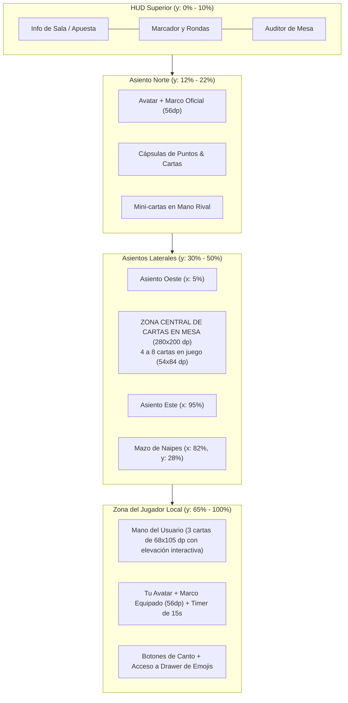

# 📐 Guía de Medidas de Sprites y Delimitación de la Mesa de Juego

Este documento detalla todas las especificaciones de diseño, medidas de exportación en píxeles y el **diagrama de zonificación espacial** para la mesa de **La Caída (CaidaGO)**.

---

## 🎨 1. Formato Recomendado: ¿PNG o SVG?

| Categoría | Formato | Especificación Técnica | Motivo |
|---|:---:|---|---|
| **Cartas y Reverso** | **PNG** | PNG-32 (Canal Alfa), sRGB | Renderizado nativo por GPU en Skia/Impeller a 60-120 FPS sin tirones al animar. |
| **Marcos de Avatar** | **PNG** | PNG-32 con centro 100% transparente | Permite efectos 3D, biseles dorados, gemas y brillos metálicos realistas. |
| **Sprites de Salas VIP** | **PNG** | PNG-32 (Transparente o portada) | Mantiene la riqueza de texturas, monumentos y paisajes de cada estado. |
| **Avatares y Héroes** | **PNG** | PNG-32 | Ilustración volumétrica de personajes. |
| **Fondos y Tapetes** | **PNG / JPG** | JPG (Calidad 92%) o PNG | Texturas continuas de madera y tapete de paño sin costo de procesamiento. |
| **Iconos planos de interfaz** | **SVG / Vector** | SVG o Material Icons | Siluetas geométricas simples y escalables (Ajustes, Cerrar, Lupa). |

---

## 📏 2. Cuadro Maestro de Medidas y Resoluciones

```
+-----------------------------------------------------------------------------------------------+
| ELEMENTO                        | TAMAÑO LÓGICO FLUTTER | EXPORTACIÓN HD (@3X / FIGMA) | RATIO |
+-----------------------------------------------------------------------------------------------+
| Carta en Mano (Usuario)        | 68 x 105 dp           | 300 x 465 px                 | 1:1.55|
| Carta en Mesa (Tapete)         | 54 x 84 dp            | 300 x 465 px (mismo asset)   | 1:1.55|
| Reverso de Baraja (REV-CARD)   | 68 x 105 dp           | 300 x 465 px                 | 1:1.55|
| Mini-carta Oponente            | 14 x 20 dp            | Escala procedural / 120x180px| 1:1.55|
| Marco de Avatar / Rango        | 56 x 56 a 72 x 72 dp  | 512 x 512 px (Centro libre)  | 1:1   |
| Avatar de Personaje            | 48 x 48 a 64 x 64 dp  | 512 x 512 px                 | 1:1   |
| Insignia de Sala (1..7 SALAS)  | 80 x 80 dp            | 512 x 512 px                 | 1:1   |
| Portada de Sala (Carrusel)     | 260 x 350 dp          | 600 x 810 px                 | 1:1.35|
| Botón Principal ("▶ JUGAR")    | 260 x 54 dp           | 780 x 162 px                 | ~4.8:1|
| Botón Mediano ("CREAR SALA")   | 180 x 46 dp           | 540 x 138 px                 | ~3.9:1|
| Botón Redondo (Chat, Cerrar)   | 40 x 40 dp            | 256 x 256 px                 | 1:1   |
| Píldora Contador (🪙 🎟️ 🏆)    | 95 x 32 dp            | 380 x 128 px                 | ~3:1  |
| Logo Principal ("CaidaGO")     | 400 x 130 dp          | 1200 x 390 px                | ~3:1  |
| Tapete de Mesa Completo        | Pantalla Completa     | 1080 x 2340 px               | 9:19.5|
+-----------------------------------------------------------------------------------------------+
```

---

## 🗺️ 3. Diagrama Visual de Delimitación de la Mesa de Juego

```
┌────────────────────────────────────────────────────────────────────────┐
│ 🔴 BARRA SUPERIOR (Puntos Sala, Timer de Ronda, Auditor de Mesa)       │
├────────────────────────────────────────────────────────────────────────┤
│                                                                        │
│                      [ JUGADOR NORTE / RIVAL 1 ]                       │
│                      ┌────────────────────────┐                        │
│                      │   Avatar + Marco (56p) │ 👑 Mano                │
│                      │   [ Puntos | Cartas ]  │                        │
│                      │   Mini-Cartas: 🂠 🂠 🂠   │                        │
│                      └────────────────────────┘                        │
│                                   │                                    │
│                         💬 Bocadillo Canto/Emoji                       │
│                                                                        │
│  [ JUGADOR OESTE / BOT 2 ]                         [ MAZO / DECK ]     │
│  ┌──────────────────────┐                          ┌─────────────┐     │
│  │ Avatar + Marco (56p) │                          │ 🂠 MAZO      │     │
│  │ [ Pts | Cartas ]     │                          │ 38 Cartas   │     │
│  │ Mini: 🂠 🂠 🂠           │                          └─────────────┘     │
│  └──────────────────────┘                                              │
│             │                                                          │
│   💬 Bocadillo                                     [ JUGADOR ESTE ]    │
│                                                    ┌─────────────────┐ │
│         ┌───────────────────────────────────────┐  │ Avatar (56p)    │ │
│         │     🎴 ZONA CENTRAL DE LA MESA        │  │ [ Pts | Cartas ]│ │
│         │          (280 x 200 dp)               │  │ Mini: 🂠 🂠 🂠     │ │
│         │                                       │  └─────────────────┘ │
│         │    [Carta 1]   [Carta 2]   [Carta 3]  │           │          │
│         │    (54x84p)    (54x84p)    (54x84p)   │   💬 Bocadillo   │
│         │                                       │                      │
│         │    [Carta 4]   [Carta 5]   [Carta ...]│                      │
│         └───────────────────────────────────────┘                      │
│                                                                        │
│                                                                        │
│               🎴 MANO DEL JUGADOR (Cartas Seleccionables)              │
│               ┌────────────┐ ┌────────────┐ ┌────────────┐             │
│               │            │ │            │ │  ELEVADA   │             │
│               │  Carta 1   │ │  Carta 2   │ │  Carta 3   │ (Tocar/     │
│               │  (68x105)  │ │  (68x105)  │ │  (68x105)  │  Deslizar)  │
│               └────────────┘ └────────────┘ └────────────┘             │
│                                                                        │
│                         💬 Tu Bocadillo / Reacción                     │
│                      ┌────────────────────────┐                        │
│                      │  👤 TU AVATAR + MARCO  │ ⏱️ Barra Tiempo (15s) │
│                      │   [ Puntos | Cartas ]  │                        │
│                      │   Nv. 5 • "Tu Nombre"  │                        │
│                      └────────────────────────┘                        │
│                                                                        │
│ [⚙️ Opciones]        [ CANTO: ¡RONDA! / ¡CAÍDA! ]          [💬 EMOJIS]  │
└────────────────────────────────────────────────────────────────────────┘
```

---

## 📐 4. Coordenadas y Distribución Espacial en Pantalla



---

## 🎯 5. Consejos de Arte y Exportación para Diseñadores

1. **Margen de Respiro (Safe Margin)**:
   - En los **Marcos (`512x512 px`)**, mantén el borde exterior a `~10px` del límite del lienzo para que las sombras y brillos (`glow`) no queden recortados bruscamente.
2. **Centro Transparente**:
   - El agujero interior de los marcos debe ser circular o cuadrado con esquinas redondeadas (`radio ~18%`) y canal alfa en cero (`0% opacidad`).
3. **Cartas Limpias**:
   - Las cartas deben incluir su propio borde blanco o bisel de carta tradicional con esquinas curvas para que contrasten nítidamente contra cualquier color de tapete.
4. **Paleta de Color Oficial del Juego**:
   - **Fondo Azul Profundo**: `#1E1763` a `#26206D`
   - **Dorado / Oro Metálico**: `#F59E0B` / `#FDE047`
   - **Cian Neón / Acentos**: `#38BDF8` / `#22D3EE`
   - **Verde Victoria**: `#22C55E` / `#10B981`
   - **Rojo Peligro / Caída**: `#EF4444` / `#DC2626`
